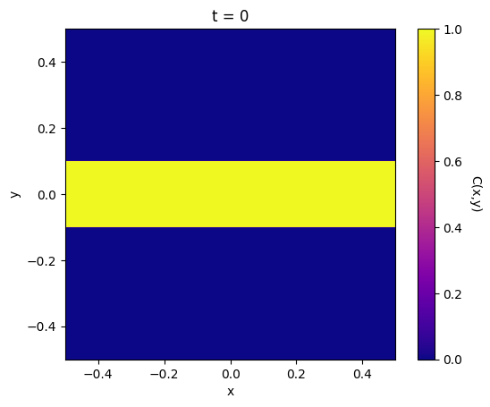
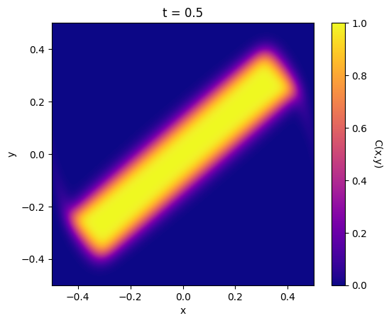
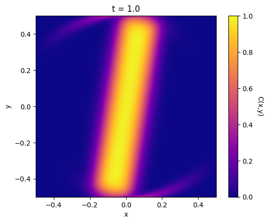

# PDE Evolution Using Distributed-Memory Parallelism

## Project Overview

This project implements a distributed-memory parallel Lax-Wendro scheme to numerically solve the advection equation. The parallelization is achieved using MPI and OpenMP. 

## Theory

The advection equation is a hyperbolic partial-differential equation (PDE) governing the conserved movement of a specified distribution of material with a given velocity. In 2D, the equation is

$$ \frac{\partial C}{\partial t} + u\frac{\partial C}{\partial x} + v \frac{\partial C}{\partial y} = 0 $$

where $C(x, y, t)$ is some scalar concentration and $(u,v)$ is the 2D velocity. In this project we will assume that the velocity is constant with respect to $t$. 

A numerical method to observe the evolution of this differential equation is the Lax-Wendro scheme. For discrete time steps and a discretized 2D domain, we will represent $C(i, j, n)$ as $C^n_{i, j}$. Given $C^n$, the Lax method gives an estimation for $C^{n+1}$ given by

$$ C^{n+1}_{i,j} = \frac{1}{4} ( C^n_{i-1, j} + C^n_{i+1, j} + C^n_{i, j-1} + C^n_{i, j+1} ) 
- \frac{\Delta t}{2 \Delta x} 
[ u (C^n_{i+1, j} - C^n_{i-1, j}) 
+ v (C^n_{i, j+1} - C^n_{i, j-1}) ]$$

## Execution Parameters

For this project, we will observe the evolution of the advection equation on the following initial conditions:

- $C\left( -\frac{L}{2}:\frac{L}{2}, -\frac{1}{2}:\frac{1}{2}, 0 \right) = 1.0$; and $C$ is 0 elsewhere.

where the domain is taken to be $\left[-L/2,L/2\right] \times \left[-L/2,L/2\right]$.

The rest of the parameters are intialized to be:
- $L = 1.0$ (Length of domain in each dimension)
- $N = 4000$ (the number of discrete slices the domain is sliced into in each direction) 
- $T = 1.0$ (total amount of time the solution is evolved for) 
- del_t $ = 1.25e^{-4}$ (the size of each discrete time step)
- $u = \sqrt{2} y$ (the $x$-component of the velocity)
- $v = -\sqrt{2} x$ (the $y$-component of the velocity)

## Code Structure

In the initialization phase, appropriate values are assigned to squares in each process based on the initial condition. During the update for each time step, when the code is executed with more than one MPI process, it employs a variant of the 'checkerboard' approach for sending and receiving across processes. Specifically, the checkerboard approach is used for trading the internal ghost cells (excluding those on the boundary) of the final matrix. Then the code exchanges right ghost cells with the left, and vice versa, while similar exchanges occur for the up-down cells.

## Results

The evolution of the solution looks like:

## Performance

The performances observed for the three types of parallelism models - OpenMP, MPI, and Hybrid (MPI + OpenMP) - used are summarized below.

| Model | Nodes |Cores per Node | Execution Time (s) | Grind Rate (cells/s) |
| ----- | ----- | ------------- | ------------------ | -------------------- |
| MPI   | 1     | 1             | 755.2              | 1.69e8               |
| MPI   | 2x1   | 1             | 478.1              | 2.68e8               |
| MPI   | 2x2   | 1             | 156.6              | 8.17e8               |
| MPI   | 3x3   | 1             | 79.4               | 1.61e9               |
| MPI   | 4x4   | 1             | 51.3               | 2.49e9               |
| OpenMP| 1     | 1             | 755.2              | 1.69e8               |
| OpenMP| 1     | 2             | 328.9              | 3.89e8               |
| OpenMP| 1     | 4             | 181.4              | 7.05e8               |
| OpenMP| 1     | 9             | 88.3               | 1.44e9               |
| OpenMP| 1     | 16            | 51.6               | 2.48e9               |
| Hybrid| 1     | 16            | 51.6               | 2.48e9               |
| Hybrid| 2x1   | 16            | 30.1               | 4.02e9               |
| Hybrid| 2x2   | 16            | 11.8               | 1.08e10              |
| Hybrid| 3x3   | 16            | 6.4                | 1.99e10              |
| Hybrid| 4x4   | 16            | 5.0                | 2.54e10              |
